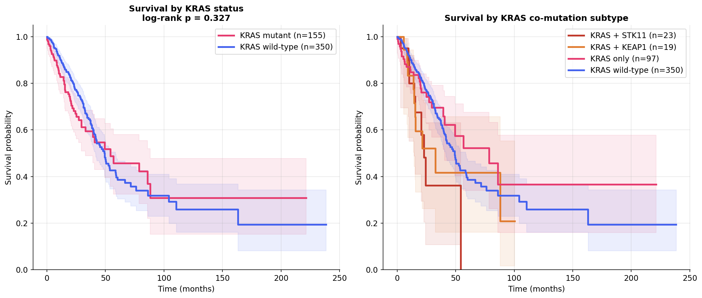
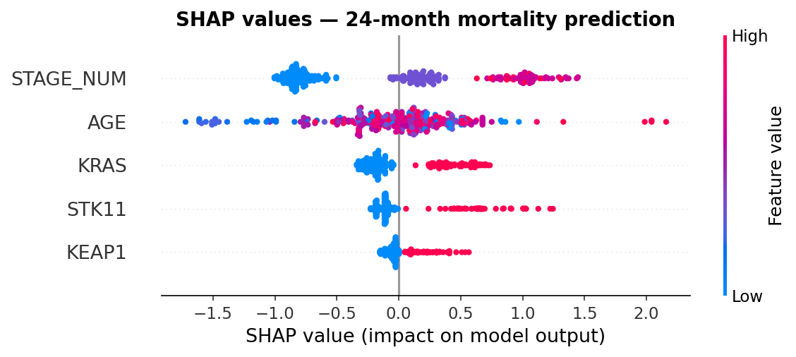

# Oncology Survival Analysis

Survival analysis and ML-based mortality prediction on public oncology datasets.

---

### 1. TCGA Lung Adenocarcinoma
**Clinical question**: Do specific mutation profiles influence survival outcomes in lung adenocarcinoma patients?

**Dataset:** 566 patients · 38 clinical variables · 225k somatic mutations (TCGA PanCancer Atlas via cBioPortal)

**Key biological question**  
KRAS is mutated in ~30% of lung adenocarcinomas. Co-occurring mutations in STK11 and KEAP1 define aggressive subtypes with poor prognosis and resistance to immunotherapy.

Can we predict this from genomic data alone?

**Analyses**
- Exploratory data analysis: demographics, tumour stage distribution
- Kaplan-Meier survival curves by tumour stage and mutation status
- KRAS subtype analysis and co-mutation patterns (STK11, KEAP1)
- Multivariable Cox proportional hazards model
- ML-based mortality prediction (XGBoost)

**Results**

*KRAS+STK11 shows the worst early survival. KRAS alone tracks close to wild-type, it's the co-mutation that matters.*

*Tumour stage dominates predictions. Among mutations, STK11 is the strongest prognostic signal (HR=1.90, p=0.002 in Cox PH).*

---

## Methods

**Kaplan-Meier**: estimates the survival function over time per group. Group differences assessed with the log-rank test

**Cox Proportional Hazards**: quantifies the effect of each variable (age, stage, mutation status) on mortality risk as a hazard ratio (HR). HR > 1 = higher risk. Proportional hazards assumption verified via Schoenfeld residuals

**ML Mortality Prediction**: binary classification (death within 24 months) using XGBoost. Evaluated with AUC-ROC and Brier score via stratified 5-fold cross-validation

---

## Stack

Python · pandas · numpy · lifelines · scikit-learn · XGBoost · matplotlib · seaborn

## Data Sources
All datasets are publicly available:
- TCGA Lung Adenocarcinoma via [cBioPortal](https://www.cbioportal.org)
- METABRIC via [cBioPortal](https://www.cbioportal.org)

## Author
Cécile Soudé — MSc Biomedical Engineering, Imperial College London
