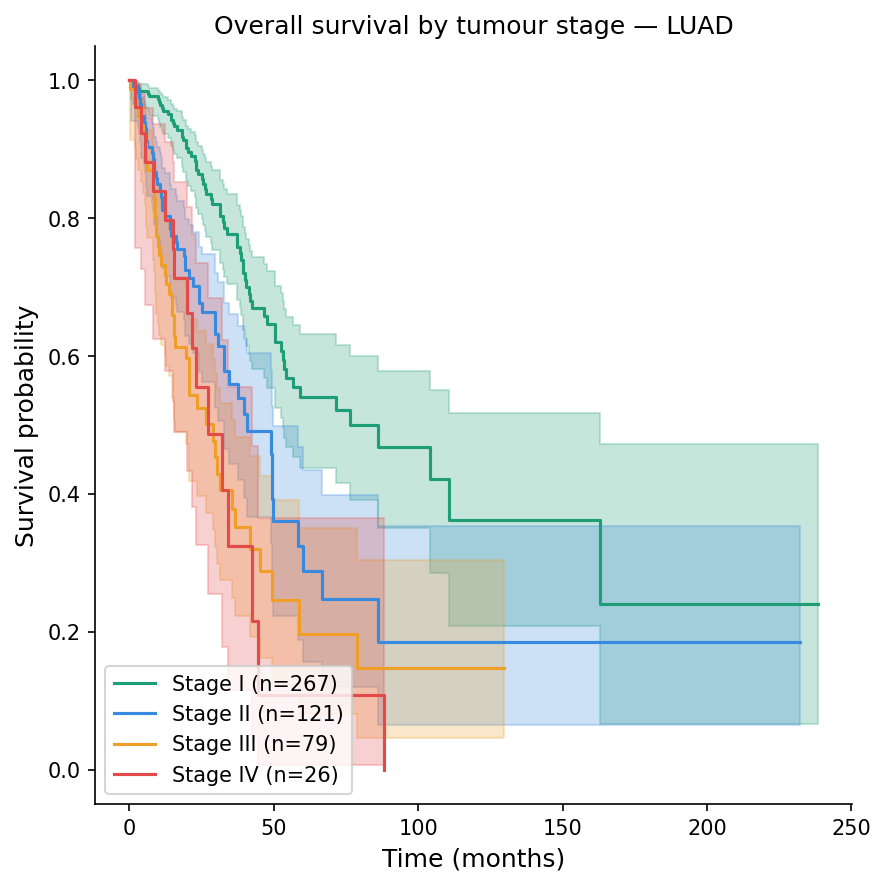

# Oncology Survival Analysis

Survival analysis and ML-based mortality prediction on public oncology datasets.

---

## TCGA Lung Adenocarcinoma

**Question:** Can mutation profiles predict survival outcomes in lung adenocarcinoma patients?

**Dataset:** 566 patients · 38 clinical variables · 225k somatic mutations (TCGA PanCancer Atlas via cBioPortal)

**Key biological question**  
KRAS is mutated in ~30% of lung adenocarcinomas.  
Co-occurring mutations in STK11 and KEAP1 define aggressive subtypes with poor prognosis and resistance to immunotherapy.

Can we predict this from genomic data alone?

**Analyses**
- Exploratory data analysis: demographics, tumour stage distribution
- Kaplan-Meier survival curves by tumour stage and mutation status
- KRAS subtype analysis and co-mutation patterns (STK11, KEAP1)
- Multivariable Cox proportional hazards model
- ML-based mortality prediction (XGBoost, Random Forest)

<!-- ADD YOUR FIGURES HERE ONCE NOTEBOOK 02 IS DONE -->
<!--  -->
<!--  -->

---

## Methods

**Kaplan-Meier**: estimates the survival function over time per group. Group differences assessed with the log-rank test

**Cox Proportional Hazards**: quantifies the effect of each variable  
(age, stage, mutation status) on mortality risk as a hazard ratio (HR).  
HR > 1 = higher risk. Proportional hazards assumption verified via Schoenfeld residuals

**ML Mortality Prediction**: binary classification (death within 24 months) using XGBoost and Random Forest. Evaluated with AUC-ROC and Brier score via stratified 5-fold cross-validation

---

## Stack

Python · pandas · numpy · lifelines · scikit-learn · XGBoost · matplotlib · seaborn

---

## Data

All datasets are publicly available via [cBioPortal](https://www.cbioportal.org/).

| Dataset | Link |
|---|---|
| TCGA Lung Adenocarcinoma | [luad_tcga_pan_can_atlas_2018](https://www.cbioportal.org/study/summary?id=luad_tcga_pan_can_atlas_2018) |

Files needed: `data_clinical_patient.txt` · `data_mutations.txt`

---

## Author

Cécile Soudé — MSc Biomedical Engineering, Imperial College London  
[LinkedIn](https://www.linkedin.com/in/cécile-soudé-384027218)